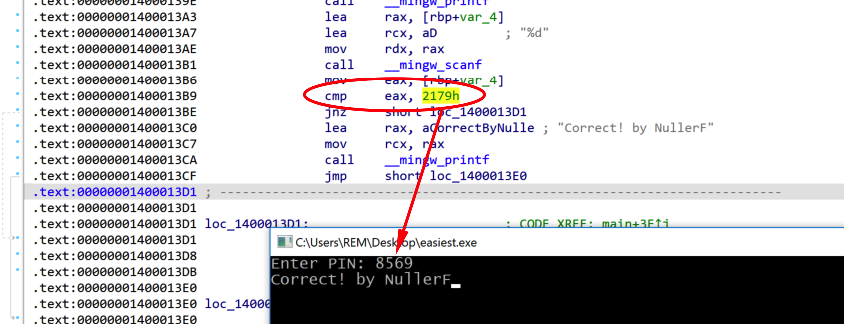

# Writeup — NullerF's Easiest

**Author:** NullerF

**Platform:** Windows x86-64

**Uploaded:** 01 Nov 2025

---

---

## Description

This crackme is written in C++. The goal is to understand how the program checks the `password`/`key` and extract the correct flag/string.

## Tools Used

* IDA Pro

## Quick Overview

find code where input compares with pin, thats it
